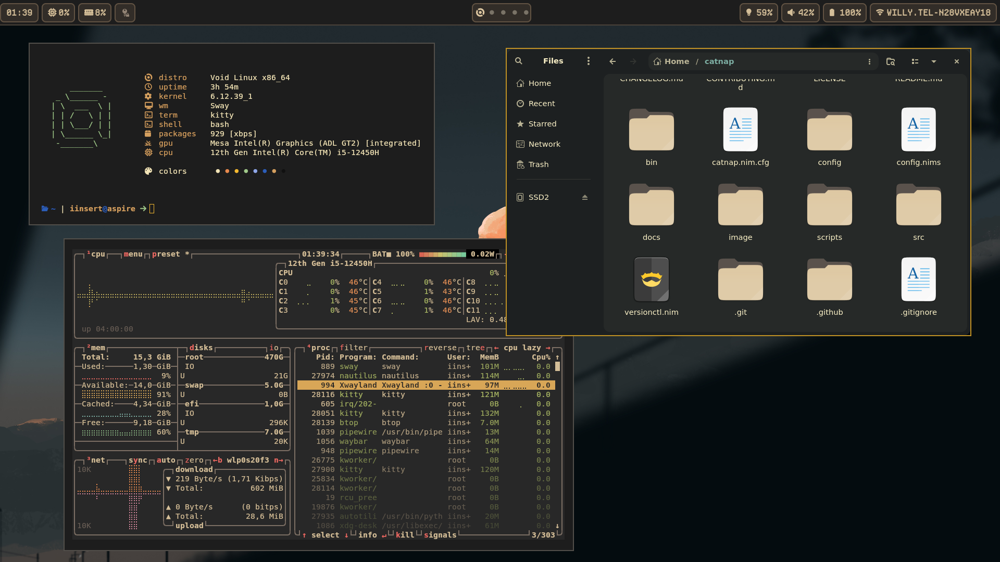
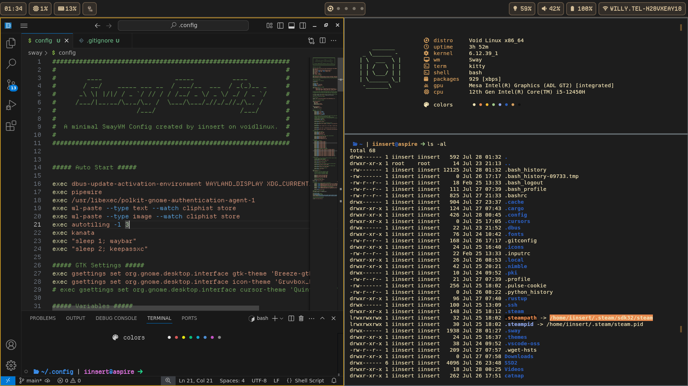
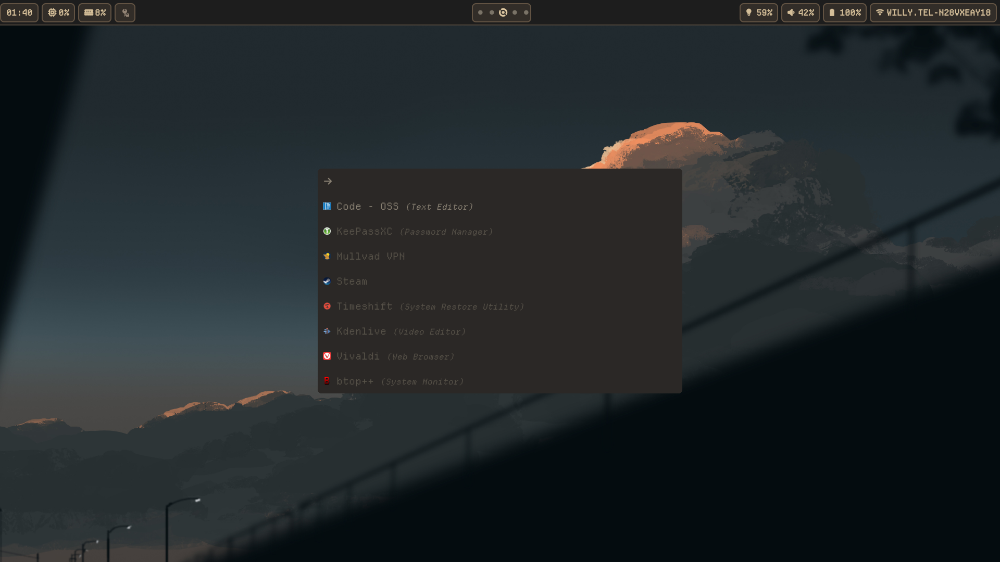

  

 

<h1 align="center">
    <a href="#used_software">Used Software</a> |
    <a href="#custom_features">Custom Features</a> |
    <a href="https://github.com/elenapan/dotfiles/wiki/Gallery">Gallery</a>
</h1>

#### This repos contains the configuration and dotfiles of my Voidlinux, Sway, Gruvbox inspired setup.

## Used Software
+ [SwayWM](https://swaywm.org) (Window Manager)
+ [SwayNC](https://github.com/ErikReider/SwayNotificationCenter) (Notification Daemon)
+ [Waybar](https://github.com/Alexays/Waybar) (Status Bar)
+ [Autotiling](https://github.com/nwg-piotr/autotiling) (Autotiling script for Sway & i3)
+ [Catnap](https://github.com/iinsertnamehere/catnap) (Fetch Program)
+ [Rofi](https://github.com/davatorium/rofi) (App Launcher)
+ [Kitty](https://github.com/kovidgoyal/kitty) (Terminal Emulator)
+ [Kanata](https://github.com/jtroo/kanata) (Keyboard Remapper | Only needed because my Leftclick is broken..)

## Custom Features
+ **AskAI** (Script for asking AI a quick question without using the browser) `[MOD + Shift + A]`
+ **Battery Warn** (Script that warns the user when the battery is low battery threshold can be configured in sway config)

## Gallery

  
  
  

